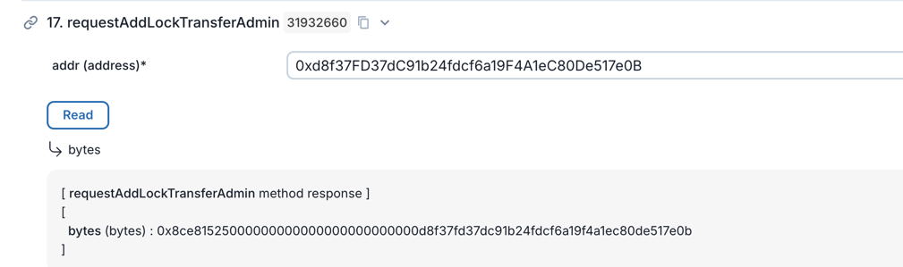
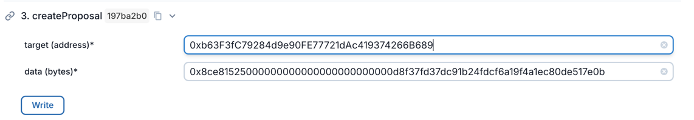
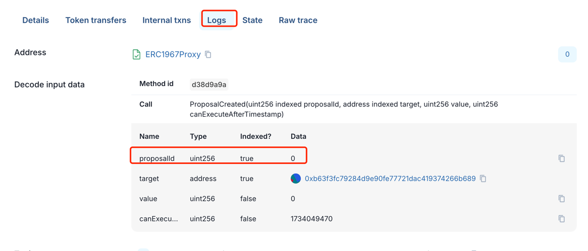
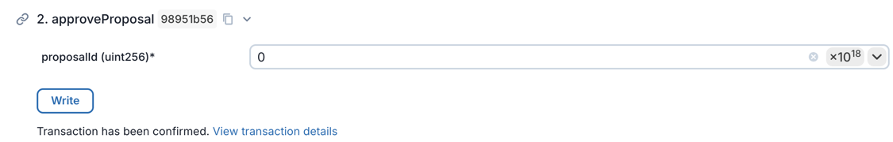
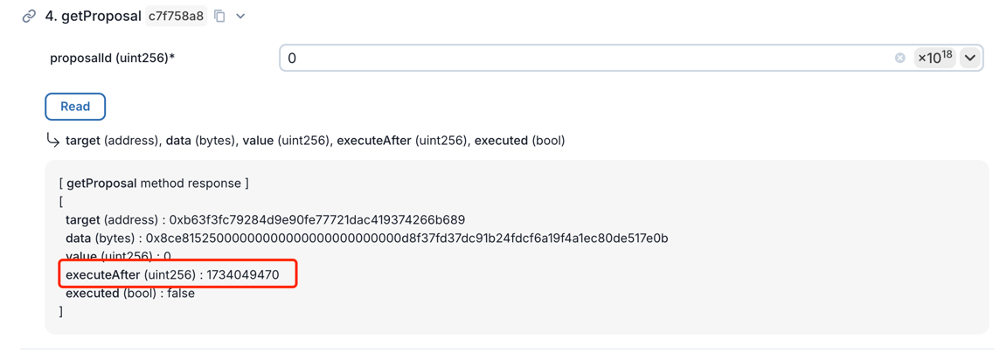
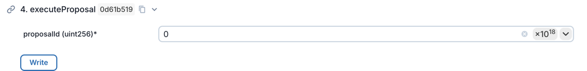

### MultiSigTimeLock contract

This contract allows multiple signer to agree on a transaction after a specified time period. The contract is designed to be used with a multisig wallet and time lock contract.

#### 一. How to use the contract
1. call request...(..) function of Token contract to get the call hash(data)
2. call createProposal(..) function of MultiSigTimeLock contract to create a proposal with the call hash and view the tx hash you will get a proposal id on Log tag (only valid signers can call this function which are set when creating the contract)
3. ask other signers to approve the proposal by calling approveProposal(..) function of MultiSigTimeLock contract with the proposal id
4. if approve count is reach the required approve count (set when creating the contract),  after the time lock period is over, anyone can call executeProposal(..) function of MultiSigTimeLock contract with the proposal id to execute the transaction

⚠️Note: any signer can revoke the proposal by calling revokeProposal(..) function of MultiSigTimeLock contract with the proposal id before the time lock period is over.

#### 二. Call ‘addLockTransferAdmin’ function Example:
1.call requestAddLockTransferAdmin of Token contract with the required parameters to get the call hash!
2.call createProposal of MultiSigTimeLock contract with the call hash and required parameters. the 'target' is the address of the Token contract and the 'data' is the call hash 
3.view the tx hash detail on dbcscan you will find the proposal id
4.ask other signers to approve the proposal by calling approveProposal of MultiSigTimeLock contract with the proposal id(you already approved the proposal when you cal createProposal function)
5.you can call getProposal function of MultiSigTimeLock contract to check the when the transaction can be execute
6.after the lock time for the proposal. anyone can call executeProposal of MultiSigTimeLock contract with the proposal id to execute the transaction and if approve count is reach the required approve count, the transaction will be executed.

